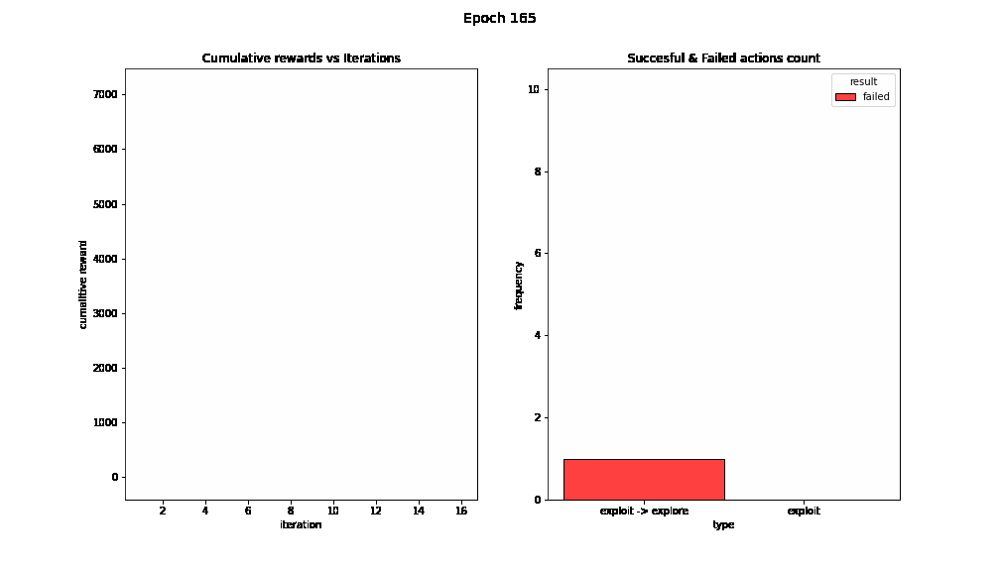

# Cyberbattle

## Qlearner training

<table>
  <tr>
    <td>
epoch
</td>
    <td>
1
</td>
    <td>
3
</td>
    <td>
125
</td>
  </tr>
  <tr>
    <td>
results
</td>
    <td></td>
    <td></td>
    <td></td>
  </tr>
  <tr>
    <td>
epoch
</td>
    <td>
165
</td>
    <td>
185
</td>
    <td>
219
</td>
  </tr>
  <tr>
    <td>
results
</td>
    <td></td>
    <td></td>
    <td></td>
  </tr>
 </table>
